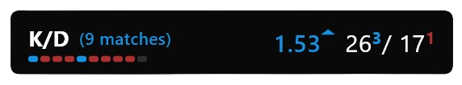
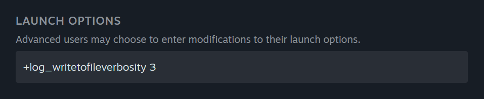
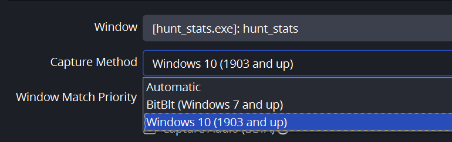

## Що це?

Мінімалістичний застосунок для відображення ігрової статистики **Hunt: Showdown** за сесію.

## Які дані будуть доступні?
- Кількість матчів
- Смерті (+окремо за поточний матч)
- Вбивства (+окремо за поточний матч)
- Співвідношення K/D
- Результати матчів в хронологічному порядку (успішна евакуація чи смерть)

## Як змусити це працювати?
0. Завантажити останню версію (2.0.0+) застосунку з Github [Releases](https://github.com/dealnotedev/dart_hunt_kda/releases)
1. Просимо гру писати більше логів - в параметрах запуску гри в Steam додати `+log_writetofileverbosity 3`

2. Увімкнути **Nvidia Highlights** для запису **Hunter killed** і **Player downed** (для власників Radeon та інших рішення поки немає)
3. За бажанням періодично чистити **\steamapps\common\Hunt Showdown\user\logbackups**, бо там будуть накопичуватись старі логи

## Щось ще?
> [!TIP]
> Якщо в директорію з ассетами покласти файл `kill.wav` або `death.wav`, то звук буде програватись при вбивстві/смерті
> Якщо треба вивести банер на Windows 11 через OBS, то рекомендується вказувати Capture Method `Windows 10 (1903 and up)`

